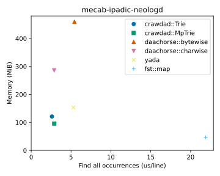

# 🦞 Crawdad: ChaRActer-Wise Double-Array Dictionary

## Overview

Crawdad is a library of natural language dictionaries using character-wise double-array tries.
The implementation is optimized for strings of multibyte-characters,
and you can enjoy fast text processing on strings such as Japanese or Chinese.

For example, on a large Japanese dictionary of IPADIC+Neologd, Crawdad has a better time-space tradeoff than other Rust libraries.

The detailed experimental settings and other results are available on [Wiki](https://github.com/daac-tools/crawdad/wiki/Performance-Comparison).

### What can do

- **Key-value mapping**: Crawdad stores a set of string keys with mapping arbitrary integer values.
- **Exact match**: Crawdad supports a fast lookup for an input key.
- **Common prefix search**: Crawdad supports fast *common prefix search* that can be used to enumerate all keys appearing in a text.

### Data structures

Crawdad contains the two trie implementations:

- `crawdad::Trie` is a standard trie form that often provides the fastest queries.
- `crawdad::MpTrie` is a minimal-prefix trie form that is memory-efficient for long strings. 

## Slack

We have a Slack workspace for developers and users to ask questions and discuss a variety of topics.

 * https://daac-tools.slack.com/
 * Please get an invitation from [here](https://join.slack.com/t/daac-tools/shared_invite/zt-1pwwqbcz4-KxL95Nam9VinpPlzUpEGyA).

## License

Licensed under either of

 * Apache License, Version 2.0
   ([LICENSE-APACHE](LICENSE-APACHE) or http://www.apache.org/licenses/LICENSE-2.0)
 * MIT license
   ([LICENSE-MIT](LICENSE-MIT) or http://opensource.org/licenses/MIT)

at your option.

## Acknowledgment

The initial version of this software was developed by LegalOn Technologies, Inc.,
but not an officially supported LegalOn Technologies product.

## Contribution

See [the guidelines](./CONTRIBUTING.md).
